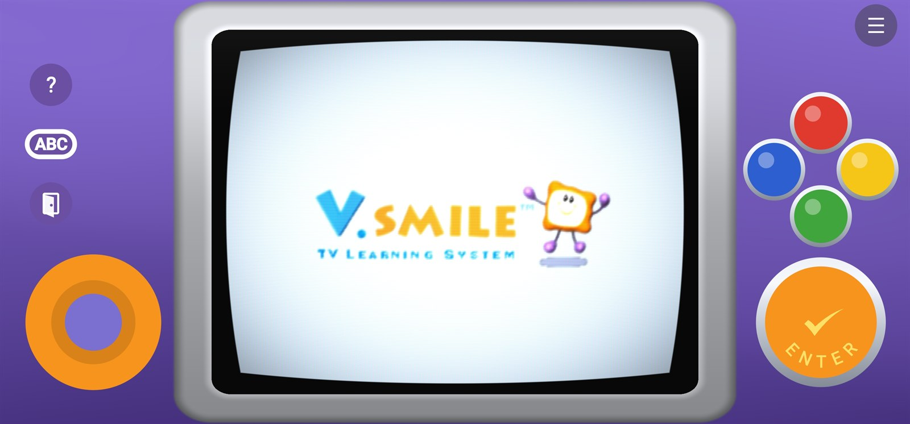
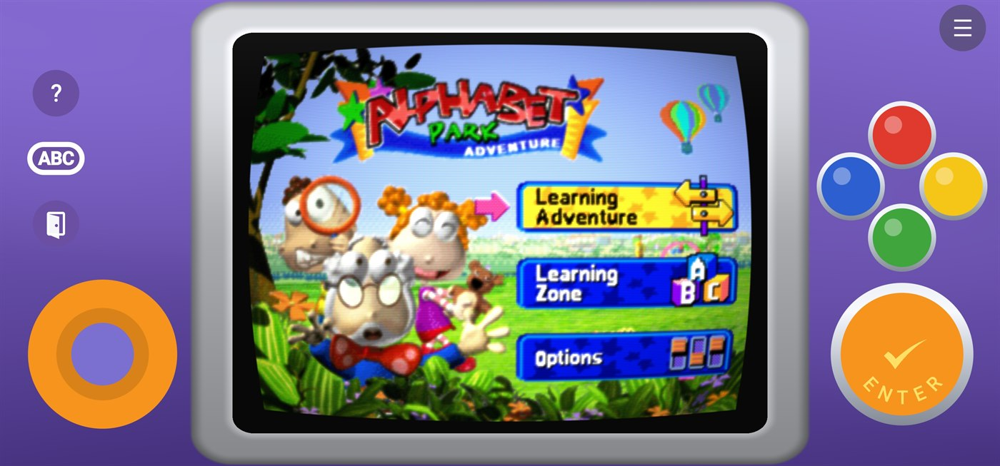
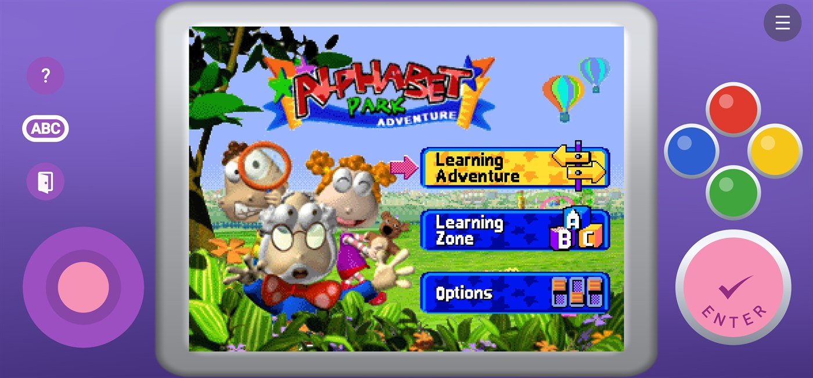

# D.Smile

**VTech V.Smile emulator for Android.**

  

## Features

**Play**
- Runs V.Smile cartridge dumps straight away, no BIOS required.
- Optional system bios import for maximum compatibility. Not necessary for most titles.
- Save states with thumbnails and timestamps, and per game slot memory.
- Rewind and fast forward with adjustable speed. 

**Look**
- CRT shader with barrel curvature, glow, scanlines, aperture grille and vignette, each with effect its own intensity slider.
- Pixel, sharp, and CRT display modes. For aspect ratio you have 4:3, stretch, and integer scaling.
- Themed letterbox backgrounds (black, wavy blue, or V.Smile purple) and silver or black TV bezels that wrap the picture.
- Two renderer options. One that should be fast and perfect for most games, but the second is intended to be a more accurate option for edge cases.

**Control**
- An on screen controller modelled on the real thing, with classic orange and pink themes.
- A full layout editor: drag to move, box select to move groups, resize with a multiplier, save and name your own layouts.
- Gamepad support with remappable buttons and bindable hotkeys for save, load, fast forward and rewind.

**Fit in**
- Launches directly into a game from front ends like iiSU, Daijisho and ES-DE.
- Lots of QOL features and bug fixes baked-in that a lot of niche emulators fall short on. 

## Screenshots

| CRT shader, classic controller | Crisp pixel mode, pink controller |
| :---: | :---: |
|  |  |

## Getting started

1. Grab the latest `D.Smile-x.y.z.apk` from [Releases](../../releases) and install it (allow installs from your browser if prompted).
2. Open D.Smile, tap **ROM folder**, and pick the folder with your `.bin` dumps.
3. Tap a game. The menu button in the top corner opens save states, video options, the layout editor and more.

A BIOS is **not required**. Games boot and play fine without one. Importing a V.Smile system ROM (tap **BIOS**) is purely optional and only adds a bit of extra compatibility that can help a handful of games. Skip it unless you run into a title that misbehaves.

## Launching from a front end

D.Smile exposes an activity that front ends can launch straight into a game. See [docs/iisu-integration.md](docs/iisu-integration.md) for the iiSU config block and the general intent contract that also covers Daijisho and ES-DE.

## License

Personal project, all original code. Not affiliated with or endorsed by VTech.
